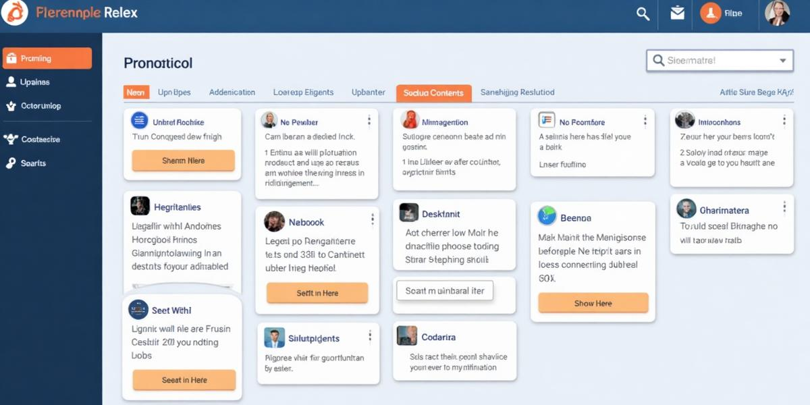

# Mini CMS - Content Management Panel

A modern, lightweight Content Management System built with React that provides a clean and intuitive interface for managing blog posts and internal announcements. This application demonstrates professional dashboard design, CRUD operations, and persistent data storage using localStorage.



## 🚀 Features

### Core Functionality
- **Full CRUD Operations**: Create, read, update, and delete posts
- **Post Management**: Title, description, and optional tags/categories
- **Persistent Storage**: Data persists between sessions using localStorage
- **Form Validation**: Required field validation with user feedback
- **Dashboard Layout**: Professional admin panel design with sidebar navigation

### Advanced Features
- **Search & Filter**: Advanced search by title, description, or tag
- **Responsive Design**: Fully responsive across mobile and desktop
- **Multiple Views**: Grid and list view options for posts
- **Data Management**: Export/import functionality for data backup
- **Real-time Feedback**: Toast notifications for user actions
- **Professional UI**: Clean, modern design with excellent UX

### Technical Features
- **TypeScript**: Full type safety throughout the application
- **Component Architecture**: Modular, reusable components
- **React Hooks**: Modern React patterns with custom hooks
- **Tailwind CSS**: Utility-first styling with design system
- **shadcn/ui**: High-quality, accessible UI components

## 🛠️ Technology Stack

- **Frontend**: React.js with TypeScript
- **Styling**: Tailwind CSS with custom design system
- **UI Components**: shadcn/ui component library
- **State Management**: React hooks (useState, useEffect)
- **Routing**: React Router DOM
- **Data Persistence**: localStorage
- **Build Tool**: Vite
- **Icons**: Lucide React

## 📱 Screenshots

### Dashboard
- Clean overview with statistics cards
- Recent posts display
- Quick access to create new posts

### Posts Management
- Grid and list view options
- Search and filter functionality
- Inline actions for edit, view, and delete

### Create/Edit Posts
- Form validation with error messages
- Auto-save functionality
- Clean, focused editing experience

## 🚀 Getting Started

### Prerequisites
- Node.js (v16 or higher)
- npm or yarn

### Installation

```bash
# Clone the repository
git clone <repository-url>

# Navigate to project directory
cd mini-cms

# Install dependencies
npm install

# Start development server
npm run dev
```

The application will be available at `http://localhost:8080`

### Build for Production

```bash
# Build the application
npm run build

# Preview the production build
npm run preview
```

## 📊 Project Structure

```
src/
├── components/          # Reusable UI components
│   ├── layout/         # Layout components (Sidebar, Header, etc.)
│   ├── post/           # Post-related components
│   └── ui/             # shadcn/ui components
├── hooks/              # Custom React hooks
├── pages/              # Page components
├── types/              # TypeScript type definitions
├── lib/                # Utility functions
└── assets/             # Static assets
```

## 🎨 Design System

The application uses a custom design system built with Tailwind CSS:

- **Colors**: Professional blue and orange color palette
- **Typography**: Clean, readable font hierarchy
- **Components**: Consistent spacing and styling
- **Responsive**: Mobile-first design approach

## 💾 Data Management

### Storage
- Posts are stored in browser's localStorage
- Data persists between browser sessions
- Automatic save on every action

### Export/Import
- Export all data as JSON file
- Import previously exported data
- Data validation on import

### Data Structure
```typescript
interface Post {
  id: string;
  title: string;
  description: string;
  tag?: string;
  createdAt: string;
  updatedAt: string;
}
```

## 🔧 Development

### Available Scripts
- `npm run dev` - Start development server
- `npm run build` - Build for production
- `npm run preview` - Preview production build
- `npm run lint` - Run ESLint

### Adding New Features
1. Create components in appropriate directories
2. Add proper TypeScript types
3. Follow existing naming conventions
4. Use the design system tokens

## 📝 Usage Guide

### Creating Posts
1. Navigate to "New Post" or click the "+" button
2. Fill in the required title and description
3. Optionally add a tag/category
4. Click "Create Post" to save

### Managing Posts
1. View all posts in the "All Posts" section
2. Use search to find specific posts
3. Filter by tags using the dropdown
4. Switch between grid and list views

### Editing Posts
1. Click "Edit" on any post card
2. Modify the content as needed
3. Click "Update Post" to save changes

### Data Export/Import
1. Go to Settings page
2. Click "Export All Data" to download JSON file
3. Use "Import Data" to restore from backup
4. Clear all data if needed (with confirmation)

## 🏆 Evaluation Criteria Met

✅ **Code Structure & Cleanliness**: Organized component hierarchy with meaningful names
✅ **Functionality**: Complete CRUD operations with validation
✅ **LocalStorage Persistence**: Data persists between sessions
✅ **UI/UX Polish**: Professional admin panel design
✅ **Reusability & Modularity**: Component-based architecture

## 🚀 Deployment

The application can be deployed to any static hosting service:

- **Vercel**: Connect GitHub repository for automatic deployments
- **Netlify**: Drag and drop the `dist` folder
- **GitHub Pages**: Use GitHub Actions for deployment

## 📄 License

This project is created as a portfolio demonstration and learning exercise.

## 🤝 Contributing

This is a demonstration project, but feedback and suggestions are welcome!

---

**Built with ❤️ using React, TypeScript, and Tailwind CSS**
